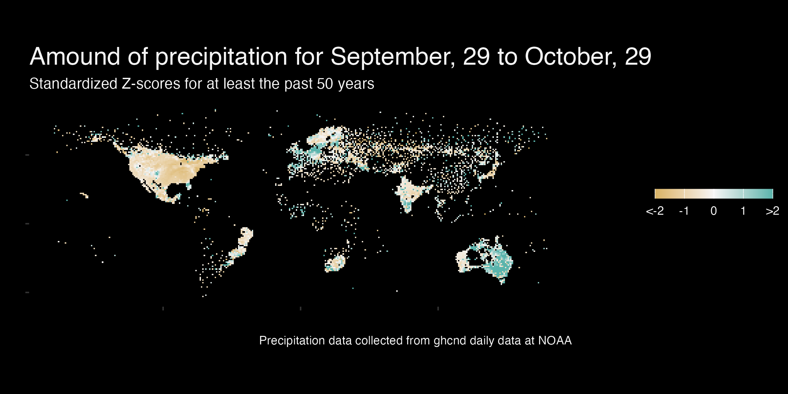

```{r echo = FALSE, message = FALSE }
library(lubridate)

```


```{css echo = FALSE}
.author, .title {
    display: none;
}
.main-container {
    max-width: 100%;
}
body {
    background-color:black;
    color: #f5f5f5;
    font-size=1.2vw;
}

```



Last updated on `r today()` by Katie Sipes  
From the [CodeClub](`r rmarkdown::metadata$github_repo`) Tutorial by [Pat Schloss](`r rmarkdown::metadata$youtubevideo`)